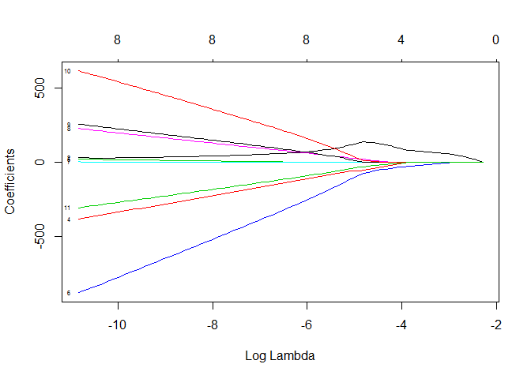
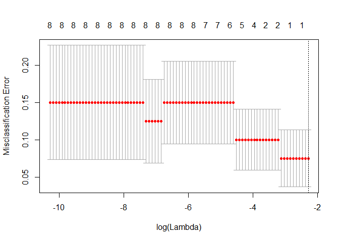

draft\_model\_prep
================
John Viviani
April 25, 2019

-   [Plots Generated from Model](#plots-generated-from-model)

Reading in the processed (all numeric) data.

``` r
newnfl_processed_data <- readRDS("C:/Users/John.JVivs/Documents/COLLEGE/GRAD SCHOOL/GDAT510/JohnV_FinalProject/data/processed/newnfl_processed_data.rds")
```

Building the model off of the processed data. select(-one\_of("drafted", "team", "player\_name")) removes the vectors of interest, in this case the 'drafted', 'team', and 'player\_name' columns. This is because the model we are developing is based off of the sentiment analysis in the data frame. model.matrix is expanding the factors of the data frame to a set of dummy variables. cv.glmnet is performing 10-fold cross validation on the newly made matrix, whereby 'drafted' is our dependent variable. It is considered binomial because there are two possible outcomes (drafted = 1, not drafted = 0). Class is used for type.measure since the variable of interest is binomial.

The model was saved in the models folder as an RDS object.

``` r
nfl.model <- newnfl_processed_data %>% 
  select(-one_of("drafted", "team", "player_name")) %>% 
  model.matrix(~ ., data = .) %>% 
  cv.glmnet(y = as.numeric(newnfl_processed_data$drafted), 
                        x = ., 
                        family = "binomial",
                        nfolds = 10,
                        alpha  = 1, 
                        type.measure = "class")
```

    ## Warning in lognet(x, is.sparse, ix, jx, y, weights, offset, alpha, nobs, :
    ## one multinomial or binomial class has fewer than 8 observations; dangerous
    ## ground

    ## Warning in lognet(x, is.sparse, ix, jx, y, weights, offset, alpha, nobs, :
    ## one multinomial or binomial class has fewer than 8 observations; dangerous
    ## ground

    ## Warning in lognet(x, is.sparse, ix, jx, y, weights, offset, alpha, nobs, :
    ## one multinomial or binomial class has fewer than 8 observations; dangerous
    ## ground

    ## Warning in lognet(x, is.sparse, ix, jx, y, weights, offset, alpha, nobs, :
    ## one multinomial or binomial class has fewer than 8 observations; dangerous
    ## ground

    ## Warning in lognet(x, is.sparse, ix, jx, y, weights, offset, alpha, nobs, :
    ## one multinomial or binomial class has fewer than 8 observations; dangerous
    ## ground

    ## Warning in lognet(x, is.sparse, ix, jx, y, weights, offset, alpha, nobs, :
    ## one multinomial or binomial class has fewer than 8 observations; dangerous
    ## ground

    ## Warning in lognet(x, is.sparse, ix, jx, y, weights, offset, alpha, nobs, :
    ## one multinomial or binomial class has fewer than 8 observations; dangerous
    ## ground

    ## Warning in lognet(x, is.sparse, ix, jx, y, weights, offset, alpha, nobs, :
    ## one multinomial or binomial class has fewer than 8 observations; dangerous
    ## ground

    ## Warning in lognet(x, is.sparse, ix, jx, y, weights, offset, alpha, nobs, :
    ## one multinomial or binomial class has fewer than 8 observations; dangerous
    ## ground

    ## Warning in lognet(x, is.sparse, ix, jx, y, weights, offset, alpha, nobs, :
    ## one multinomial or binomial class has fewer than 8 observations; dangerous
    ## ground

    ## Warning in lognet(x, is.sparse, ix, jx, y, weights, offset, alpha, nobs, :
    ## one multinomial or binomial class has fewer than 8 observations; dangerous
    ## ground

``` r
saveRDS(nfl.model, "C:/Users/John.JVivs/Documents/COLLEGE/GRAD SCHOOL/GDAT510/JohnV_FinalProject/data/models/nfl.model.rds")
```

Plots Generated from Model
--------------------------

As lambda increases, the size of the coefficients gradually reach 0. When log lambda is about -2 the coefficients are 0. Coefficients 10 (trust) and 6 (fear) appear to have more significance in the model than the remaining coefficients. However, fear is improving as we reduce lambda, whereas trust is decreasing as we reduce lambda.

``` r
plot(nfl.model$glmnet.fit, xvar = "lambda", label = TRUE)
```



According to this plot, the log of the optimal value of lambda is nearly -2, which gives us the lowest misclassification error. This is accounted for by only one variable in the model.

``` r
plot(nfl.model)
```


